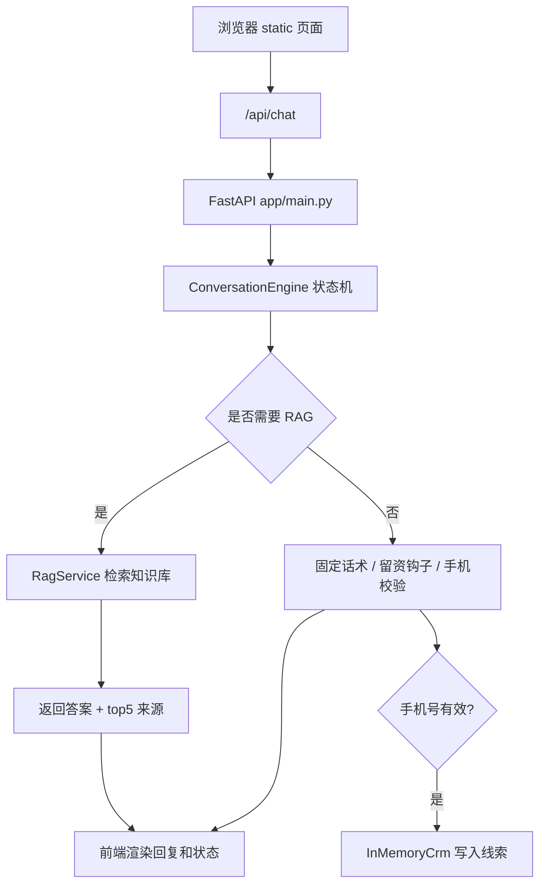
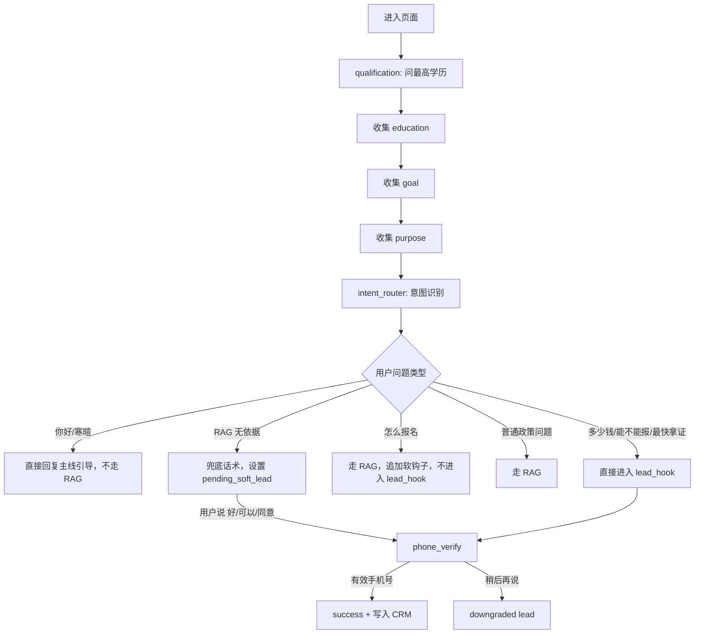

## 总体架构

```mermaid
flowchart TD
  A["浏览器 static 页面"] --> B["/api/chat"]
  B --> C["FastAPI app/main.py"]
  C --> D["ConversationEngine 状态机"]
  D --> E{"是否需要 RAG"}
  E -- 否 --> F["固定话术 / 留资钩子 / 手机校验"]
  E -- 是 --> G["RagService 检索知识库"]
  G --> H["返回答案 + top5 来源"]
  F --> I["前端渲染回复和状态"]
  H --> I
  F --> J{"手机号有效?"}
  J -- 是 --> K["InMemoryCrm 写入线索"]
```

## 主要流程

```mermaid
flowchart TD
  A["进入页面"] --> B["qualification: 问最高学历"]
  B --> C["收集 education"]
  C --> D["收集 goal"]
  D --> E["收集 purpose"]
  E --> F["intent_router: 意图识别"]
  F --> G{"用户问题类型"}
  G -- "你好/寒暄" --> H["直接回复主线引导，不走 RAG"]
  G -- "多少钱/能不能报/最快拿证" --> I["直接进入 lead_hook"]
  G -- "怎么报名" --> J["走 RAG，追加软钩子，不进入 lead_hook"]
  G -- "普通政策问题" --> K["走 RAG"]
  G -- "RAG 无依据" --> L["兜底话术，设置 pending_soft_lead"]
  L -- "用户说 好/可以/同意" --> M["phone_verify"]
  I --> M
  M -- "有效手机号" --> N["success + 写入 CRM"]
  M -- "稍后再说" --> O["downgraded lead"]
```
