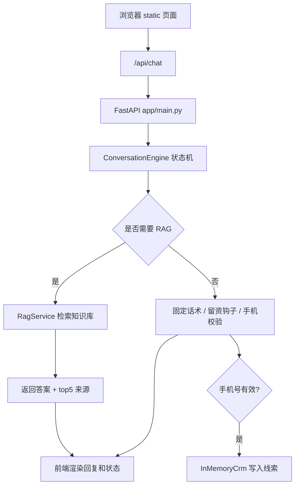
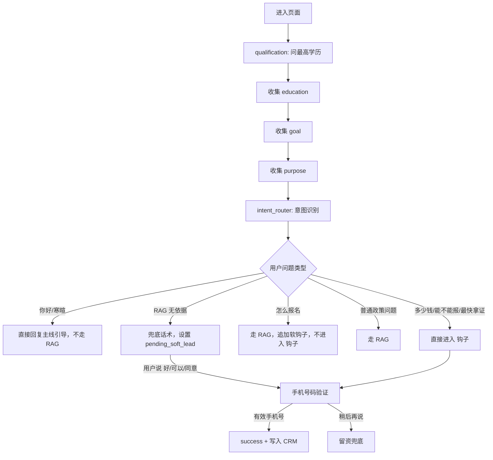

## 总体架构


## 主要流程


# 部署运行说明

## 1. 环境

- Python 3.10+
- 项目根目录执行命令

## 2. 安装

Windows PowerShell:

```powershell
python -m venv .venv
.\.venv\Scripts\Activate.ps1
pip install -r requirements.txt
Copy-Item .env.example .env
```

macOS/Linux:

```bash
python3 -m venv .venv
source .venv/bin/activate
pip install -r requirements.txt
cp .env.example .env
```

## 3. 配置

本地无 API Key 也能跑。将 `.env` 设置为：

```env
QWEN_API_KEY=
QWEN_BASE_URL=https://dashscope.aliyuncs.com/compatible-mode/v1
QWEN_MODEL=qwen3.5-flash
LLM_ENABLED=false
RAG_EMBEDDING_ENABLED=false
```

如需启用 Qwen 和向量检索：

```env
QWEN_API_KEY=你的DashScope_API_Key
LLM_ENABLED=true
RAG_EMBEDDING_ENABLED=true
```

修改 `.env` 后需要重启服务。

## 4. 启动

```bash
uvicorn app.main:app --host 127.0.0.1 --port 8000 --reload
```

访问：

- 页面：http://127.0.0.1:8000/
- 健康检查：http://127.0.0.1:8000/health
- API 文档：http://127.0.0.1:8000/docs

服务器部署可用：

```bash
uvicorn app.main:app --host 0.0.0.0 --port 8000
```

## 5. 验证

```bash
curl http://127.0.0.1:8000/health
```

预期返回：

```json
{"status":"ok"}
```

运行测试：

```bash
python -m pytest
```

## 6. RAG 数据

服务默认读取：

```text
data/rag/chunks.jsonl
```

如需重新生成 RAG 数据：

```bash
python -m app.rag.build_curated_knowledge --source data/source_crgk_text_documents --output data/rag
```

如需重建向量索引，先设置 `QWEN_API_KEY` 和 `RAG_EMBEDDING_ENABLED=true`，启动服务后执行：

```bash
curl -X POST http://127.0.0.1:8000/api/rag/rebuild
```

## 7. 常见问题

- 端口被占用：把 `--port 8000` 改成其他端口。
- PowerShell 无法激活虚拟环境：先执行 `Set-ExecutionPolicy -Scope Process -ExecutionPolicy Bypass`。
- 无 API Key：设置 `LLM_ENABLED=false`、`RAG_EMBEDDING_ENABLED=false`。
- CRM 数据保存在内存中，服务重启后会清空。
